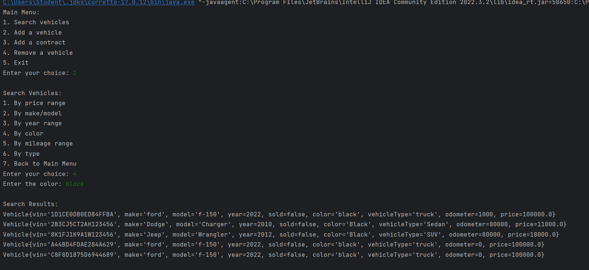
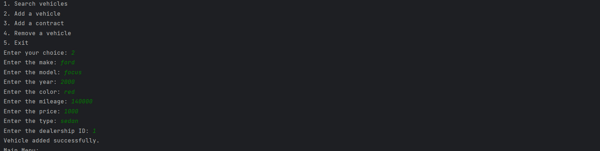
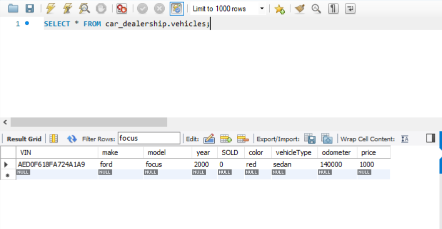
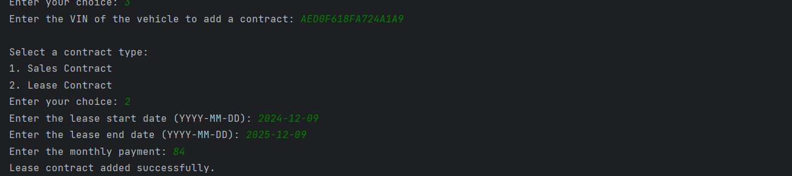
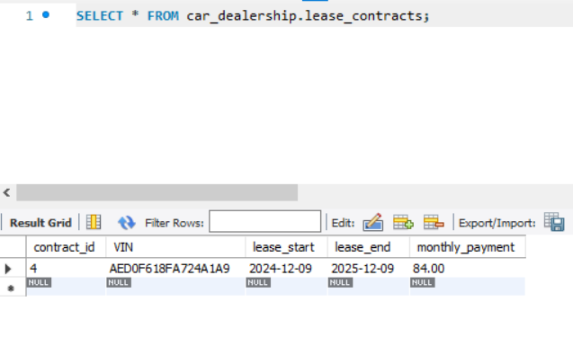

# jdbc Dealership

## Description of the Project

This version of the dealership allows users to connect intellij to SQL Workbench and filter data. Using the combination of java and SQL queries I am able to ask users prompts and give them search information based on that.

## User Stories

- As a user, I want to have the ability to add a vehicle to the inventory.
- As a user, I want to have the ability to remove a vehicle from the inventory.
- As a user, I want to have the ability to add a lease contract into the database.
- As a user, I want to have the ability to add a sales contract into the database.
- As a user, I want to have the ability to add a vehicle into the vehicle database.
- As a user, I want to have the ability to remove a vehicle from the vehicle database.
- As a user, I want to have the ability to search vehicles by price range.
- As a user, I want to have the ability to search vehicles by make and model.
- As a user, I want to have the ability to search vehicles by year range.
- As a user, I want to have the ability to search vehicles by color.
- As a user, I want to have the ability to search vehicles by mileage range.
- As a user, I want to have the ability to search vehicles by vehicle type.

## Setup
The application will feature a series of menus where users can make selections by inputting numbers/and letters.

### Prerequisites

- IntelliJ IDEA: Ensure you have IntelliJ IDEA installed, which you can download from [here](https://www.jetbrains.com/idea/download/).
- Java SDK: Make sure Java SDK is installed and configured in IntelliJ.

### Running the Application in IntelliJ

Follow these steps to get your application running within IntelliJ IDEA:

1. Open IntelliJ IDEA.
2. Select "Open" and navigate to the directory where you cloned or downloaded the project.
3. After the project opens, wait for IntelliJ to index the files and set up the project.
4. Find the main class with the `public static void main(String[] args)` method.
5. Right-click on the file and select 'Run 'YourMainClassName.main()'' to start the application.

## Technologies Used
- IntelliJ IDEA Community Edition 2022.3.2
- Spring boot
- My SQL Workbench 8.0 CE

## Demo
Search by color

Adding a car

Adding lease contract

## Future Work

- I would like to learn how I will be able to convert this into an actual website.

## Resources

- https://github.com/RayMaroun

## Team Members

- Brandon, provides a great support system and great competitor while coding.

## Thanks

Express gratitude towards those who provided help, guidance, or resources:

- Thank you to Raymond for continuous support and guidance.
- A special thanks to all teammates for their dedication and teamwork.